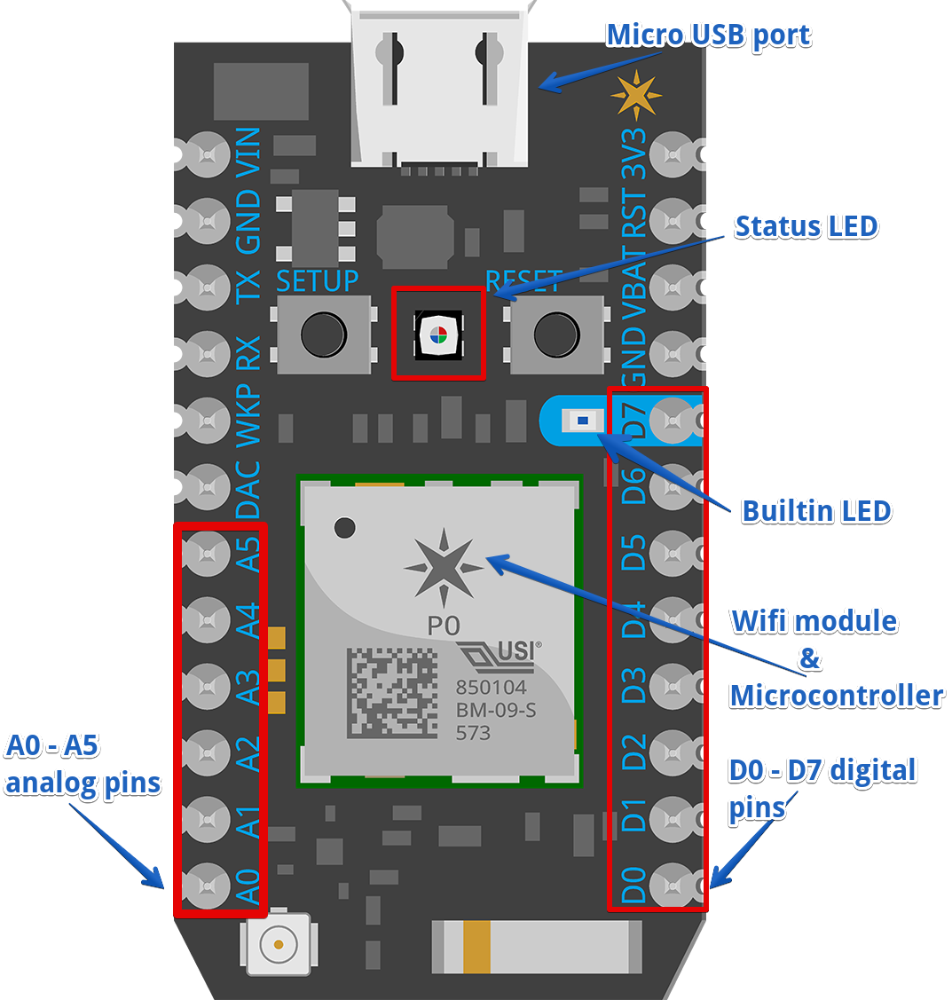

# Setup WIFI & Reset Photon 

## Setup WIFI

These steps must be used when moving device to new WIFI locations

USE LAPTOP OR COMPUTER  
OPEN CHROME WEB BROWSER  
DO NOT USE MOBILE DEVICES!  

1. Setup Photon: <a href="http://rvciot.app/start" target="blank">Click Here</a>
1. Return Here
1. Click <b>PHOTON P/SERIES</b>
1. Plug-in photon into wall power (sometimes computer power fluctuates & has to much noise)
1. Gather your <b>WIFI SSID & Password</b> 
1. Click <b>NEXT</b>
1. Click <b>CONTINUE WITH LOCAL FILE</b>, allow to download then open file
1. Follow Steps to Connect to Photon & Keep Device Name the same to keep API connections like IFTTT intact.
1. When you see Your Photon is good to go! —> Click the <b>WEB IDE</b> link
1. You are now reeady to flash with Particle app 

## Reset Photon

These steps must be used when device is connected to WIFI but unable to be flashed or code is acting up

USE LAPTOP OR COMPUTER 
OPEN CHROME WEB BROWSER 
DO NOT USE MOBILE DEVICES!  

1. Plug-in photon in wall power (sometimes computer power fluctuates & has to much noise)
1. Put Photon in SAFE MODE: 
    *** To put your device in Safe Mode:Hold down BOTH buttons (Reset and Setup) 
    *** Release only the RESET button, while holding down the SETUP button.
    *** Wait for the LED to start blinking magenta
    *** Release the SETUP button 
 
1. Once in SAFE MODE (The Photon indicates that it is in Safe Mode with the LED breathing magenta)
1. Setup Photon: <a href="http://rvciot.app/start" target="blank">Click Here</a>
1. Click <b>PHOTON P/SERIES</b>
1. Gather your <b>WIFI SSID & Password</b> 
1. Click <b>NEXT</b>
1. Click <b>CONTINUE WITH LOCAL FILE</b>, allow to download then open file
1. Follow Steps to Connect to Photon & Keep Device Name the same to keep API connections like IFTTT intact.
1. When you see Your Photon is good to go! —> Click the <b>WEB IDE</b> link
1. You are now reeady to flash with Particle app 
